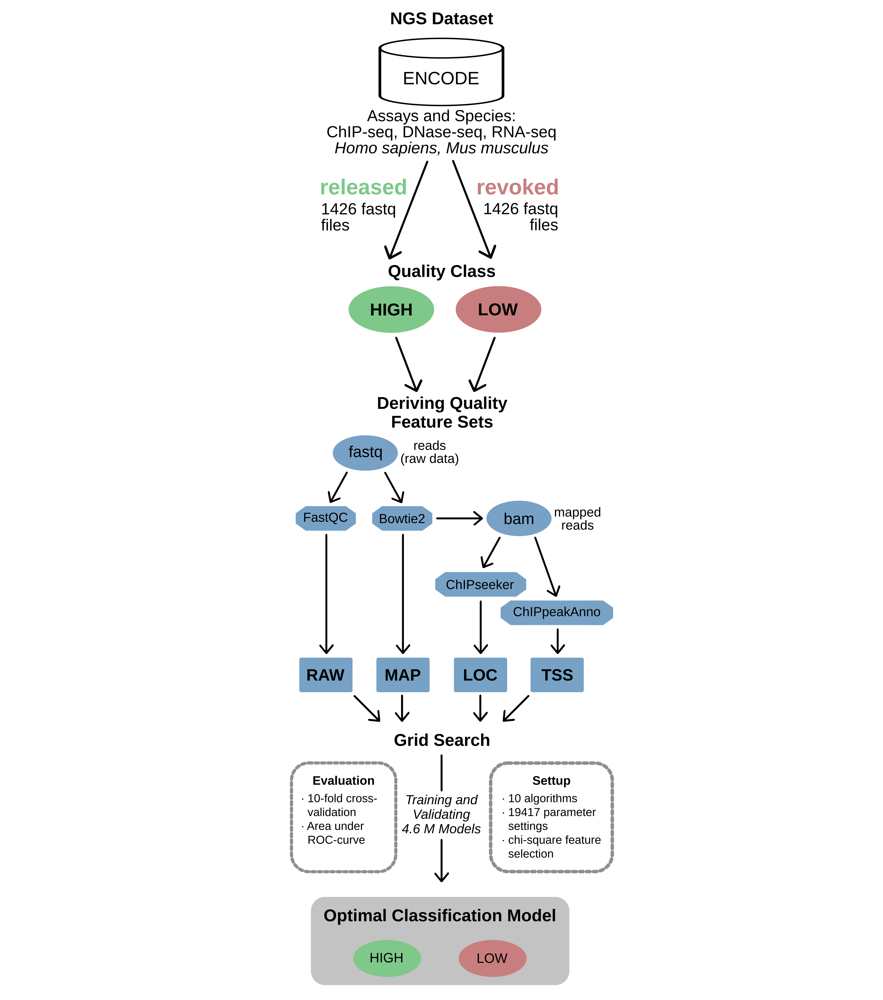

# Machine Learning Quality Assessment of NGS Data

seqQscorer is a python implementation that takes quality statistics or report summaries (quality features) as input to calculate a probability of an input NGS sample to be of low quality. This probability is calculated with classification models from supervised machine learning. The quality features are derived from FastQ and BAM files as shown in the Figure below and described in detail in our [article in Genome Biology](https://genomebiology.biomedcentral.com/articles/10.1186/s13059-021-02294-2). 

The following figure describes the workflow implemented to receive and preprocess NGS data from ENCODE and applying a grid-search to find the optimal classification model. The optimization depends on the experimental context (species or assay) and the quality features that are provided by the user. Already computed classification models are not available in the github repository. However, the software contains settings for an over all well-performing generic model and multiple more specialized models, that can be trained with the ENCODE data given or new data. The first time a model is needed, it is trained and serialized into the folder `models`. Note, the model training is done within seconds and afterwards it is not necessary to train again. The models are trained on the preprocessed ENCODE data (in utils) as described in the article.

For more details we refer to our research article, however, this paragraph provides a brief description for the feature sets. The *RAW* features are derived with FastQC and contain essentially its report summary. The *MAP* features are the mapping statistics from a Bowtie2 alignment. From this alignment, the feature sets *LOC* and *TSS* are derived that describe the distribution of reads in genomic regions with certain functionalities respectively the distribution of reads close to TSS positions. For the latter feature sets the Bioconductor packages ChIPseeker and ChIPpeakAnno are used.

Additionally the script `deriveFeatureSets.py` is available in this repository. It allows the user to preprocess all quality feature sets that are needed to properly run seqQscorer and provides the results in an already readable way for seqQscorer. An example for its usage is provided below. 



## Software installation

Especially the preprocessing requires several bioinformatic tools and software packages. The easiest and fastest way to get ready for seqQscorer is pulling the docker and running the scripts inside the docker. The following descriptions explain how to get started with docker. However, it is also possible to install everything manually (see further installation guides at the bottom of this README). 

To start with docker, please open a Linux terminal and run the following commands to first install docker, then pull, and finally run the image.

```
sudo apt-get install docker
sudo apt-get install docker.io 

sudo docker login

sudo docker pull salbrec/seqqdocker
sudo docker run -i -t -v "/home/:/home/" salbrec/seqqdocker /bin/bash

```

When using the docker you’ll be directly within the right directory and able to use the scripts right away. Note, that you might save the output to your project directories and you might also prefer to use the updated github repository. Simply type `git pull` to update the repository within the docker.

We recommend to clone the git repository outside the docker. Especially the seqQscorer script does not require non-standard python packages and some users might prefer to work without the docker or even use an own installation. To clone the repository into your desired destination, change directory with `cd` and run:

```
git clone https://github.com/salbrec/seqQscorer.git
```

#### *Check out further installation guides for running Docker with Windows 10 or creating your own conda environment (on the bottom of this README)*

## Getting the first information from the software within your installation

Change directory into the seqQscorer repository and run the usage information:

```
python deriveFeatureSets.py --help
python seqQscorer.py --help
```

The expected output looks like this, for `python deriveFeatureSets.py --help`:

```

usage: deriveFeatureSets.py [-h] --fastq1 FASTQ1 [--fastq2 FASTQ2] --btidx
                            BTIDX [--outdir OUTDIR] [--cores CORES]
                            [--fastqc {1,2}] [--assembly {GRCh38,GRCm38}]
                            [--gtf GTF] [--name NAME]

seqQscorer Preprocessing - derives feature sets needed leveraged by seqQscorer

optional arguments:
  -h, --help            show this help message and exit
  --fastq1 FASTQ1, -f1 FASTQ1
                        Input fastq file. Either the fastq file for a single-
                        end sample or the fastq file for read 1 of a paired-
                        end sample. Using this default destination
                        "./feature_sets/", all feature sets are computed and
                        saved. The file names define the sampleID while the
                        file endings define the feature sets RAW, MAP, LOC and
                        TSS.
  --fastq2 FASTQ2, -f2 FASTQ2
                        In case of a paired-end sample, the fastq file for
                        read 2. When the preprocessing is applied on paired-
                        end samples, FastQC is applied to the read 1 by
                        default. Also the sampleID for the output files are
                        named by the file name of read1. These two aspects can
                        be cahnged by using --fastqc respectively --name.
  --btidx BTIDX, -ix BTIDX
                        Filename prefix for Bowtie2 Genome Index (minus
                        trailing .X.bt2).
  --outdir OUTDIR, -o OUTDIR
                        Output directory. Default: "./feature_sets/"
  --cores CORES, -c CORES
                        Defines the number of processors (CPUs) to be used by
                        bowtie2 and samtools. (decreases runtime)
  --fastqc {1,2}, -f {1,2}
                        The fastq on which FastQC is applied on. Can
                        optionally be selected for paired-end samples.
  --assembly {GRCh38,GRCm38}, -a {GRCh38,GRCm38}
                        Species assembly needed to define the gene structure /
                        annotation used by the bioconductor functions. (has to
                        be consistent with the species used in for Bowtie2)
  --gtf GTF, -g GTF     File path for a gtf file to be used to get the LOC and
                        TSS features. (--assembly will be ignored then)
  --name NAME, -n NAME  By default the output files are named by the file name
                        of --fastq1. In order to change this to a custom name,
                        use this option.


```

Expected output for `python seqQscorer.py --help`:

```

usage: seqQscorer.py [-h] --indir INDIR [--species {generic,human,mouse}]
                     [--assay {generic,ChIP-seq,DNase-seq,RNA-seq}]
                     [--runtype {generic,single-end,paired-end}]
                     [--model MODEL] [--noRAW] [--noMAP] [--noLOC] [--noTSS]
                     [--noFS] [--bestCalib] [--peaktype {narrow,broad}]
                     [--probOut PROBOUT] [--compOut COMPOUT]
                     [--inputOut INPUTOUT] [--noVerbose] [--seed SEED]
                     [--sampleID SAMPLEID]

seqQscorer - A machine learning application for quality assessment of NGS data

optional arguments:
  -h, --help            show this help message and exit
  --indir INDIR, -i INDIR
                        Input directory containing the feature set files. The
                        feature set files are perfectly fomated by the script
                        "deriveFeatures.py": the file names (until the ".")
                        define the sample ID while the file endings define the
                        corresponding feature set RAW, MAP, LOC, and TSS. By
                        default seqQscorer applies the machine learning model
                        to all samples from the given directory within
                        milliseconds. However, it can be restricted to one
                        sample using --sampleID.
  --species {generic,human,mouse}, -s {generic,human,mouse}
                        Species specifying the model used.
  --assay {generic,ChIP-seq,DNase-seq,RNA-seq}, -a {generic,ChIP-seq,DNase-seq,RNA-seq}
                        Assay specifying the model used.
  --runtype {generic,single-end,paired-end}, -r {generic,single-end,paired-end}
                        Run-Type specifying the model used.
  --model MODEL, -m MODEL
                        Path to a serialized model, trained on own data. If
                        used, the parameters --species, --assay, and --runtype
                        have no impact on the classification model.
  --noRAW               Ignore all RAW features.
  --noMAP               Ignore all MAP features.
  --noLOC               Ignore all LOC features.
  --noTSS               Ignore all TSS features.
  --noFS                Switch off feature selection. (has only an impact if
                        the best performance was achieved with chi2 or RFE)
  --bestCalib           Classifier setting is used that achieved the lowest
                        brier score, hence the best calibration of the
                        probabilities.
  --peaktype {narrow,broad}, -pt {narrow,broad}
                        Optionally specify the peak-type for ChIP-seq data.
  --probOut PROBOUT, -po PROBOUT
                        To specify an output file for the probabilities.
                        Output will be tab-separated.
  --compOut COMPOUT, -co COMPOUT
                        To specify an out file for the comprehensive output.
                        Output will be kind of tab-separated.
  --inputOut INPUTOUT, -io INPUTOUT
                        To specify an out file that will contain the parsed
                        input. Output will be tab-separated.
  --noVerbose, -nv      Turn off verboseness, without being quiet.
  --seed SEED, -rs SEED
                        Some classifiers apply randomization. Use --seed to
                        make results reproducible. By default the seed 1 is
                        used, set it to -1 if using a seed is not desired. For
                        K-nearest neighbor and Naive Bayes the seed has no
                        impact.
  --sampleID SAMPLEID, -id SAMPLEID
                        Restrict application of seqQscorer to only one sample
                        defined by the ID.


```

## Preprocessing for fastq files

To produce the features, a bowtie index is needed that matches the assembly used for your data. You can obtain it from the official Bowtie2 webpage as follows, the human GRCh38 is used as an example (more examples are described in this [README](utils/genome_index/README.md))

```
# change directory to utils and genome_index
cd ./utils/genome_index

wget https://genome-idx.s3.amazonaws.com/bt/GRCh38_noalt_as.zip     # for downloading
unzip GRCh38_noalt_as.zip                                           # for unzipping
```

If you would like to test the `deriveFeatureSets.py` for a small example file right away, there is one in the docker: `/var/examples/single/ENCFF165NJF.fastq.gz`. Files for a paired-end test can be found here: `/var/examples/paired/`. Note, these are examples just for testing the installation, the files were reduced to randomly picked reads. Especially the paired-end example has only ~100k reads which is far less than a real NGS sample.

All seqQscorer feature sets can be derived by using the provided python script applied on an input fastq file or a pair of fastq files in case of paired-end sequencing. 

```
python deriveFeatureSets.py --fastq1 /var/examples/single/ENCFF165NJF.fastq.gz --btidx ./utils/genome_index/GRCh38_noalt_as/GRCh38_noalt_as --assembly GRCh38
```
The results will be in the default output folder `./feature_sets/`, use `--outdir` to specify the destination of the feature sets.

The following run represents a paired-end example using the genome index for *Mus musculus*. The parameter `--cores` allows the usage of multiple CPUs to accelarate computation, especially the mapping. In this example the feature set files are written to this folder: `./mouse_pe/`.

```
python deriveFeatureSets.py --fastq1 /var/examples/paired/ENCFF310LVJ.fastq.gz --fastq2 /var/examples/paired/ENCFF410LTA_r2.fastq.gz --cores 4 --btidx ./utils/genome_index/mm10/mm10 --assembly GRCm38 --outdir ./mouse_pe/
```

### Preprocessing with own gene structure files

The preprocessing procedure runs for the genome assemblies GRCh38 and GRCm38 which were used within the study. In case you would like to run everything with your own data for another species or an older human or mouse genome assembly, it is possible to use gtf files for the Bioconductor packages that derive the LOC and TSS features. 

Since we ran into compatibility problems while implementing this option, we recommend to use an **NCBI** genome index for Bowtie2, downloaded from this website: [http://bowtie-bio.sourceforge.net/bowtie2/index.shtml](http://bowtie-bio.sourceforge.net/bowtie2/index.shtml). 

The gtf file should be downloaded from Ensembl via their FTP Download website: [https://www.ensembl.org/info/data/ftp/index.html](https://www.ensembl.org/info/data/ftp/index.html).

Of course, the Bowtie2 index and the gtf file have to represent data from the same genome assembly.

The easiest is to have everything within this repository folder. We suggest to download the required gtf file into the gene structure folder in utils. Execute the following lines to download and properly extract the gtf files from the Ensembl FTP server.  The first example is for a human gtf file, the second is for a rat gtf file, also used in the next example run.

```
# change directory to utils and gene_structure
cd ./utils/gene_structure

# for human
wget ftp://ftp.ensembl.org/pub/release-101/gtf/homo_sapiens/Homo_sapiens.GRCh38.101.gtf.gz 
gunzip Homo_sapiens.GRCh38.101.gtf.gz

# for rat (Rattus norvegicus)
wget ftp://ftp.ensembl.org/pub/release-101/gtf/rattus_norvegicus/Rattus_norvegicus.Rnor_6.0.101.gtf.gz
gunzip Rattus_norvegicus.Rnor_6.0.101.gtf.gz
```

Having the index and gtf, it is straight forward to preprocess fastq files for other organisms. An example for *Rattus norvegicus*:

```
python deriveFeatureSets.py --fastq1 /var/examples/ENCFF165NJF.fastq.gz --btidx ./utils/genome_index/Rnor_6.0/Rnor_6.0 --outdir ./rat_data/ --gtf ./utils/gene_structure/Rattus_norvegicus.Rnor_6.0.101.gtf -c 4 
```

## Applying seqQscorer on preprocessed data

After deriving the feature sets the application of seqQscorer can be as simple as the following line. Check out the parameters that allow you to specify the feature sets used and especially the classification model that is applied.

```
python seqQscorer.py --indir ./feature_set_examples/
```

By default the generic classification model is (trained and) used to calculate the quality probabilities. According to our analyses, its performance is comparable to the more specialized models. Furthermore the generic model is the most reliable one as it was trained on the largest dataset. However, depending on the data that was available for our investigations, some specialized models are available. You can specify the model with the parameters `--species`, `--assay`, and `--runtype`. seqQscorer will then automatically select the model that achieved the highest auROC (area under ROC curve) for this subset. Besides the generic model, specialized models are available for all feature set combinations out of RAW, MAP, LOC, and TSS and for these specifications: (human, ChIP-seq, single-ended), (mouse, ChIP-seq, single-ended), (human, ChIP-seq, paired-ended), (human, DNase-seq, paired-ended), (mouse, DNase-seq, paired-ended), (human, RNA-seq, single-ended).

By default, seqQscorer uses all feature sets, but there are also parameters to be used if certain feature sets should be ignored. For instance, the LOC features can be ignored by using the flag `--noLOC`.

seqQscorer prints some interesting information to the console. With options such as `--probOut` and `--compOut` it is possible to save your results to a given file name.

From our preprocessed grid search, we already defined algorithms and parameter settings that performed well on the different datasets. Some of them achieved the best performance when applied together with a feature selection method. By default a preprocessed feature selection is applied when it was shown in the grid search that it improves the predictive performance. However, if you want to switch off the feature selection, use `--noFS`. 

By default the model is selected that achieved the highest predictive performance, thus the highest auROC. You can also tell seqQscorer to use the model that achieved the best calibration with respect to the probabilities. This is done by `--bestCalib`. Note that sometimes the calibration (expressed by the Brier-loss) could not be drastically improved by another model that differs from the model that achieved the highest auROC.

During our investigations we also analyzed the impact of peak-type specification. When seqQscorer is applied to ChIP-seq data homogeneous for narrow or broad peaks, we recommend to use the corresponding ChIP-seq model. For broad-peak data from human biosamples we recommend to further specify the model by peak-type. This can be done with the `--peaktype` option, e.g. `--peaktype narrow`.

The following example demonstrates the usage of all these parameters. It uses the optimal model for human, paired-end ChIP-seq for narrow peak-type without feature selection and the model is selected by best calibration. The LOC and TSS feature sets are ignored and the model is trained with selected seed. Furthermore, output files are defined to save both the probabilities and the comprehensive output. In this example seqQscorer runs without verboseness and only for the sample ENCFF137DWP in the folder `./feature_set_examples/`.

```
python seqQscorer.py --indir ./feature_set_examples/ --species human --assay ChIP-seq --runtype single-end --peaktype narrow --noLOC --noTSS --bestCalib --noFS --probOut ./the_probability.tsv --compOut ./comprehensive_output.txt --seed 42 -nv --sampleID ENCFF137DWP
```

## Guideline Reports

For our study we derived different types of features used for quality prediction as described above and more comprehensively in our research article. These features were shown to be very informative for automatic quality control and we derived these features for a large dataset containing more than 2000 NGS samples from ENCODE. In addition to seqQscorer, that applies machine learning models to derive a single value describing the samples probability of being of low quality, we found it very interesting to have an opportunity to manually inspect NGS samples in comparison to this precious reference ENCODE dataset. 

In order to address this we provide the script `guidelineReports.py` that creates a single report showing the distribution of all quality feature values from the ENCODE samples together with the feature values from a given sample. These reports serve as guidelines to support manual NGS quality control of single samples of interest or even for a set of samples.

Having all feature sets for several samples in one folder as it is done by the `deriveFeatureSets.py` script, the guideline reports can be created in this way:

```
python guidelineReports.py --indir ./feature_set_examples/
```

Similar to seqQscorer the application can be restricted to a single sampleID with `--sampleID`. The reference ENCODE data can also be specified using `--species`, `--assay`, and `--runtype`. For example, when `--species human` is used, the reference dataset will contain a mix of assays and runtypes but only for human samples. Or with `--assay ChIP-seq` the reference plots are created only for ChIP-seq samples. By default the reports are written into this folder `./guideline_reports/` in `PDF` format. The destination can be changed with`--outdir` and also the file format can be changed to `PNG` or `SVG` by using the `--format` parameter (e.g. `--format png`).

The following example demonstrates the usage of all these parameters. It specifies the reference samples for human, paired-end ChIP-seq and creates the report only for ENCFF165NJF in the folder `./feature_set_examples/`. The output directory is changed to `./svg_report/` and the report file format will be `svg`.

```
python guidelineReports.py --indir ./feature_set_examples/ --species human --assay ChIP-seq --runtype single-end --outdir ./svg_report/ --format svg --sampleID ENCFF165NJF
```

## Training a new model on your labeled data

The basic idea of our machine learning approach can also be used on new data, of course. The most critical information needed are the quality labels. Having these, in best case manually curated, a supervised classification algorithm can train a model on this labeled data. This model can then be applied on new data in order to perform automatic quality control as demonstrated in our research article. 

Based on your own data you can use the script `trainNewModel.py` to train and serialize a model that is afterwards applied on new samples to compute a quality probability (automatic quality control). The script does not run the whole grid search as we did for our investigations (it would require a lot of resources and time), but it uses classifier configurations that trained highly accurate models in our study.

The requirements are essentially:
* a folder containing the feature sets for the training samples (as preprocessed by the `deriveFeatureSets.py` script)
* a tab-separated table that links the sample IDs (file names of the feature sets files) to a quality label 1 (low-quality) or 0 (high-quality). By default the column “quality” is used. However, if the column you created is not called “quality”, use the option `--column` to specify the name of the column that contains the labels. Note, the sample ID column has to be named "sampleID".
* an output path to specify where to save the model

Here we provide an use case from the ATAC-seq cistrome data for human biosamples that was also part of the external validation within our study. This use case contains 90 samples for training and 6 samples for the application of the model. As we use the cistrome flags for labeling, the data had to be anonymized.

```
python trainNewModel.py --training ./cistrome_ATAC_seq_use_case/training/ --labels ./cistrome_ATAC_seq_use_case/labels.tsv --column thresh3 --model ./model_ATAC_seq.model
```

The resulting model is trained on all samples within the directory given by `--training`. Before this model is trained and serialized, a 10-fold cross-validation is performed on the same input data and the same classifier specification. During the cross-validation useful information about the model performance and different metrics are derived for a varying decision threshold. This information is printed to the console to give more information to the user about the model performance. 

The serialized model, trained on your data, can then be applied on new data. This is done again with the `seqQscorer.py` script and the `--model` option: 

```
python seqQscorer.py --indir ./cistrome_ATAC_seq_use_case/application/ --model model_ATAC_seq.model -nv
```

## Further installation guides

### Installation with Docker Desktop on Windows

To install Docker Desktop follow the instructions on their website:
https://docs.docker.com/docker-for-windows/install/

Use git from powershell to clone seqQscorer
```
git clone https://github.com/salbrec/seqQscorer.git

```
To get the image and activate it is similar to Linux. 
However it is advisable to only link the SeqQscorer folder.
Docker mentions that binding Windows Volumes can lead to performance drops and suggest to bind mounted folders from the linux filesystem in wsl rather than a folder on the windows file system.
Both work fine and can be accessed via powershell from the windows side or from the bash from the Linux/WSL side.

Below is an example from powershell, for linux just add sudo in front.
```
docker pull salbrec/seqqdocker
docker run -i -t --name seqQscorer -v "C:/Users/User/seqQscorer:/seqQscorer" salbrec/seqqdocker 
```
Now you can just change to the newqscorer folder and start using the software!
```
(SeqQscorer) root@ xxx : cd seqQscorer
```
In this example the SeqQscorer folder that is on windows is to find in the root of the docker image.
The docker image is named SeqQscorer and can be invoked by this name in the future.
You can copy files from the windows side (like your fastq's) and compute from the docker side.

Docker advises to use WSL, the mounted Linux System for Windows. If you want to use this, the installation and handling would be similar to the normal Linux installation, but the Installation of Docker Desktop for Windows also needs to be done.

### Installation with ANACONDA  

First, install anaconda in case you do not have it in your linux machine. We recommend to use the one that is suggested here. For the installation of Anaconda run the following two lines in your terminal.

```
wget https://repo.anaconda.com/archive/Anaconda3-2020.11-Linux-x86_64.sh
bash Anaconda3-2020.11-Linux-x86_64.sh

```
Accept licence and installation requirements with "return" and "yes", but follow the instructions, you might like to change the directory for anaconda. After installation it is necessary to initialize conda and add the channels needed:
```
source ~/.bashrc

conda config --add channels conda-forge
conda config --add channels bioconda

```

Now use the yml file `conda_env.yml` to create the conda environment and activate it.

```
conda env create -f conda_env.yml
conda activate seqQscorer
```

For the installation of the Bioconductor packages we made the experience that the best way is to install them separately within R using the BiocManager. This procedure successfully installed all dependencies in several tests.

```
R

# Within R run the following lines to install the R packages needed:
install.packages("BiocManager")
BiocManager::install("ChIPpeakAnno")
BiocManager::install("ChIPseeker")
BiocManager::install("TxDb.Hsapiens.UCSC.hg38.knownGene")
BiocManager::install("TxDb.Mmusculus.UCSC.mm10.knownGene")

```

## How to cite seqQscorer

If you use seqQscorer for your study, research, analyses, or investigations, please cite our [article in Genome Biology](https://genomebiology.biomedcentral.com/articles/10.1186

Albrecht, S., Sprang, M., Andrade-Navarro, M. A., & Fontaine, J. F. (2021). seqQscorer: automated quality control of next-generation sequencing data using machine learning. *Genome Biology*, 22(1), 1-20.


