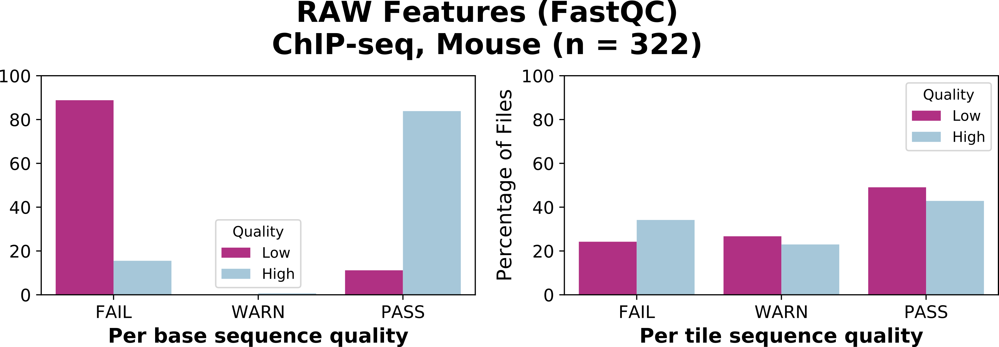

# Statistical Guidelines for Quality Assessment

The quality of NGS files can be assessed by comparing their automatically derived quality features to many publicly available high- and low-quality NGS files.

This directory contains the statistical analysis of thousands of high- and low-quality NGS files from ENCODE. Files have been compared using quality features derived from raw data by the FastQC tool ([RAW](RAW/)), genome mapping by the Bowtie2 ([MAP](MAP/)), genomic localization by the ChIPseeker library ([LOC](LOC/)), and transcription start sites profile by the ChIPpeakAnno library ([TSS](TSS/)). Comprehensive results are presented in corresponding sub-directories for the full dataset or data subsets for human and mouse ChIP-seq, DNAse-seq and RNA-seq.

## Examples:

The following example shows the distribution of values as bar plots for two [RAW](RAW/) quality features derived by FastQC in 322 mouse ChIP-seq files. Considering a given FastQ file having the value PASS for the feature “Per base sequence quality”, it is likely that the FastQ file is of high-quality. Statistics derived for feature “Per tile sequence quality” do not allow such a clear conclusion (more similar distributions of values between high- and low-quality files).

The following example shows the distribution of values as boxplots for four genome mapping features ([MAP](MAP/)) derived by Bowtie2 in mouse ChIP-seq files. For a given FastQ file, when the value of feature “No Mapping” is lower than 40%, it is likely that the FastQ file is of high-quality. Statistics derived for feature “Multiple” (mapping) do not allow such a clear conclusion (closer distributions of values between high- and low-quality files).

